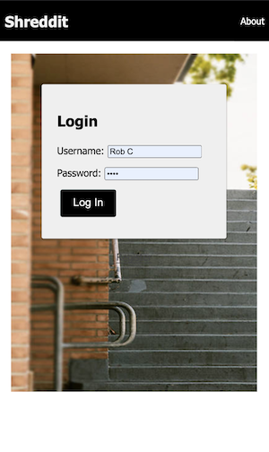
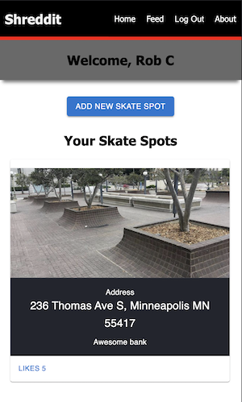
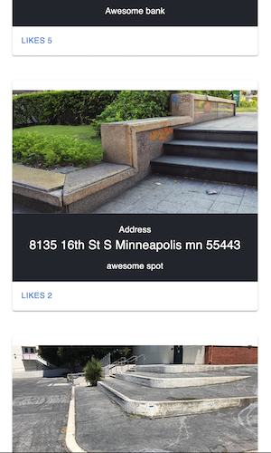
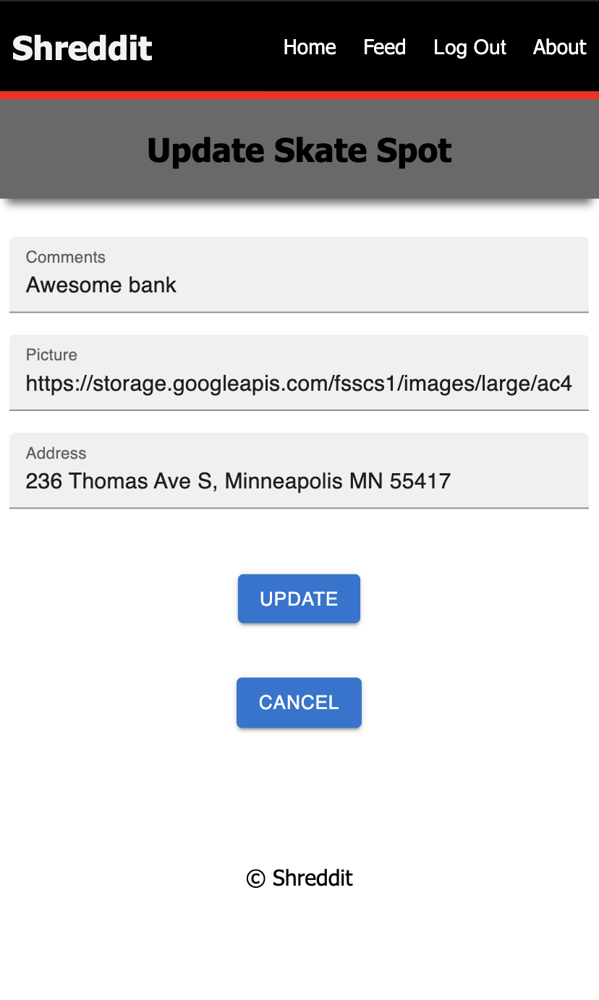

# Shreddit: A skateboarding application to share and find skate spots.

## Description

_Duration: Two Weeks Challenge_

Skateboarders are able to log in, create a profile, upload pictures and locations of skateboarding spots, as well as add comments and updates for other skateboarders.

Users are expected to interact with this application on a mobile device.

## Screenshots



Login.





After user is logged in they will be able to
- Add a new skate spot.
- Edit existing skate spots by tapping on pictures.
- View feed of all users skate spots.
- Scroll through the own personal feed.
- View how many likes their skate spot have from other users


<!-- Once a existing skate spot image is tapped on the user can
update information about the skate spot or choose to delete it.
If delete is tapped user will be asked to confirm decision and
be brought back to the users home feed. -->



<!-- If update is tapped the user can change the information about 
the skate spot. If confirmed changes will be made and the user
will be brought back to the users home feed. -->


## Prerequisites

Before you get started, make sure you have the following software installed on your computer:

- [Node.js](https://nodejs.org/en/)
- [PostrgeSQL](https://www.postgresql.org/)
- [Nodemon](https://nodemon.io/)

## Create database and table

Create a new database called `prime_app` and create a `user` table:

```SQL
CREATE TABLE "user" (
    "id" SERIAL PRIMARY KEY,
    "username" VARCHAR (80) UNIQUE NOT NULL,
    "password" VARCHAR (1000) NOT NULL
);
```

If you would like to name your database something else, you will need to change `shreddit` to the name of your new database name in `server/modules/pool.js`

## Development Setup Instructions

- Run `npm install`
- Create a `.env` file at the root of the project and paste this line into the file:
  ```
  SERVER_SESSION_SECRET=superDuperSecret
  ```
  While you're in your new `.env` file, take the time to replace `superDuperSecret` with some long random string like `25POUbVtx6RKVNWszd9ERB9Bb6` to keep your application secure. Here's a site that can help you: [https://passwordsgenerator.net/](https://passwordsgenerator.net/). If you don't do this step, create a secret with less than eight characters, or leave it as `superDuperSecret`, you will get a warning.
- Start postgres if not running already by using `brew services start postgresql`
- Run `npm run server`
- Run `npm run client`
- Navigate to `localhost:3000`

## Production Build

Before pushing to Heroku, run `npm run build` in terminal. This will create a build folder that contains the code Heroku will be pointed at. You can test this build by typing `npm start`. Keep in mind that `npm start` will let you preview the production build but will **not** auto update.

- Start postgres if not running already by using `brew services start postgresql`
- Run `npm start`
- Navigate to `localhost:5000`

## Lay of the Land

There are a few videos linked below that show a walkthrough the client and sever setup to help acclimatize to the boilerplate. Please take some time to watch the videos in order to get a better understanding of what the boilerplate is like.

- [Initial Set](https://vimeo.com/453297271)
- [Server Walkthrough](https://vimeo.com/453297212)
- [Client Walkthrough](https://vimeo.com/453297124)

Directory Structure:

- `src/` contains the React application
- `public/` contains static assets for the client-side
- `build/` after you build the project, contains the transpiled code from `src/` and `public/` that will be viewed on the production site
- `server/` contains the Express App

This code is also heavily commented. We recommend reading through the comments, getting a lay of the land, and becoming comfortable with how the code works before you start making too many changes. If you're wondering where to start, consider reading through component file comments in the following order:

- src/components
  - App/App
  - Footer/Footer
  - Nav/Nav
  - AboutPage/AboutPage
  - InfoPage/InfoPage
  - UserPage/UserPage
  - LoginPage/LoginPage
  - RegisterPage/RegisterPage
  - LogOutButton/LogOutButton
  - ProtectedRoute/ProtectedRoute

## Deployment

1. Create a new Heroku project
1. Link the Heroku project to the project GitHub Repo
1. Create an Heroku Postgres database
1. Connect to the Heroku Postgres database from Postico
1. Create the necessary tables
1. Add an environment variable for `SERVER_SESSION_SECRET` with a nice random string for security
1. In the deploy section, select manual deploy

## Update Documentation

Customize this ReadMe and the code comments in this project to read less like a starter repo and more like a project. Here is an example: https://gist.github.com/PurpleBooth/109311bb0361f32d87a2
