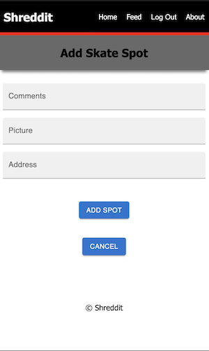
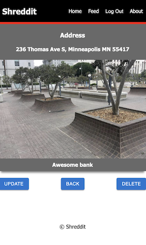
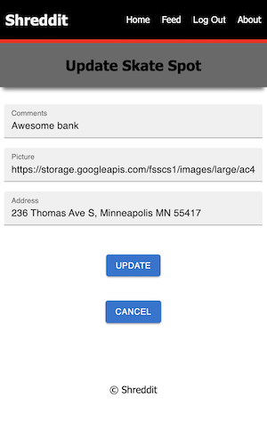
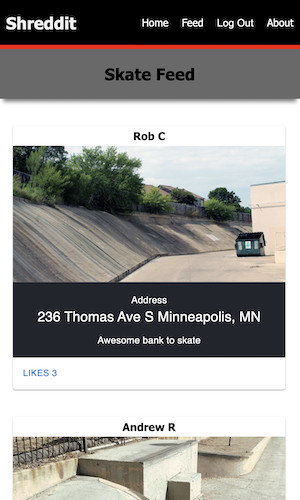

# Shreddit: A skateboarding application to share and find skate spots.

## Description

_Duration: Two Weeks Challenge_

Skateboarders are able to log in, create a profile, upload pictures and locations of skateboarding spots, as well as add comments, likes and updates for other skateboarders.

Users are expected to interact with this application on a mobile device.

## Screenshots


Login.


After a user is logged in they will be able to.
- Add a new skate spot.
- Edit existing skate spots by tapping on pictures.
- View feed of all user skate spots.
- Scroll through their own personal feed.
- View how many likes their skate spots have from other users.
 

 
If add spot is tapped on the user will be brought to this page where they can add in comments, an image and address. Once a user clicks add and confirms information the spot will be added to their home feed and all user feed.
 

 
Once an existing skate spot image is tapped on the user can
update information about the skate spot or choose to delete it.
If delete is tapped user will be asked to confirm decision and
be brought back to the user's home feed.
 

 
If update is tapped the user can change the information about
the skate spot. If confirmed changes will be made and the user
will be brought back to the user's home feed.


 
If a user taps on Feed from the Navigation bar they will be able to view all other user skate spots they added, be able to like the spots and find out where it is located. They can get back to their personal feed by pressing home on the navigation bar.

## Installation

1. After cloning this repository, set up a PostgreSQL database called `shreddit` on port 5432. You might want to use [Postico](https://eggerapps.at/postico/) as a GUI to help this setup process.
2. Use the commands in the `database.sql` file in the root directory of the project to set up tables in the database with some dummy data.
3. Run `npm install` to install dependencies in this project.
4. In the root directory of the project, set up a file called `.env` and in this file add only the following lines, where the text in quotation marks should appear without quotation marks, but be the desired server session secret:

```
SERVER_SESSION_SECRET="my_super_secret_text"
```

5. Run `npm server start` to start the server, which will run on port 5000.
6. Run `npm client start` to start the client, which will run on port 3000.
7. Running the client should open up a browser window to `localhost:3000` where you can view and use the app. You can also manually type in this address in your browser.

## Prerequisites

Before you get started, make sure you have the following software installed on your computer:

- [Node.js](https://nodejs.org/en/)
- [PostrgeSQL](https://www.postgresql.org/)
- [Nodemon](https://nodemon.io/)

## Built With

1. [Node.js](https://nodejs.org/en/)
2. [Express](https://expressjs.com/)
3. [React](https://reactjs.org/)
4. [Redux](https://redux.js.org/)
5. [Redux-Saga](https://redux-saga.js.org/)
6. [PostgreSQL](https://www.postgresql.org/)
7. [Material-UI](https://mui.com/)
8. [axios](https://www.npmjs.com/package/axios)
9. [Figma](https://www.figma.com)
9. HTML
10. CSS


